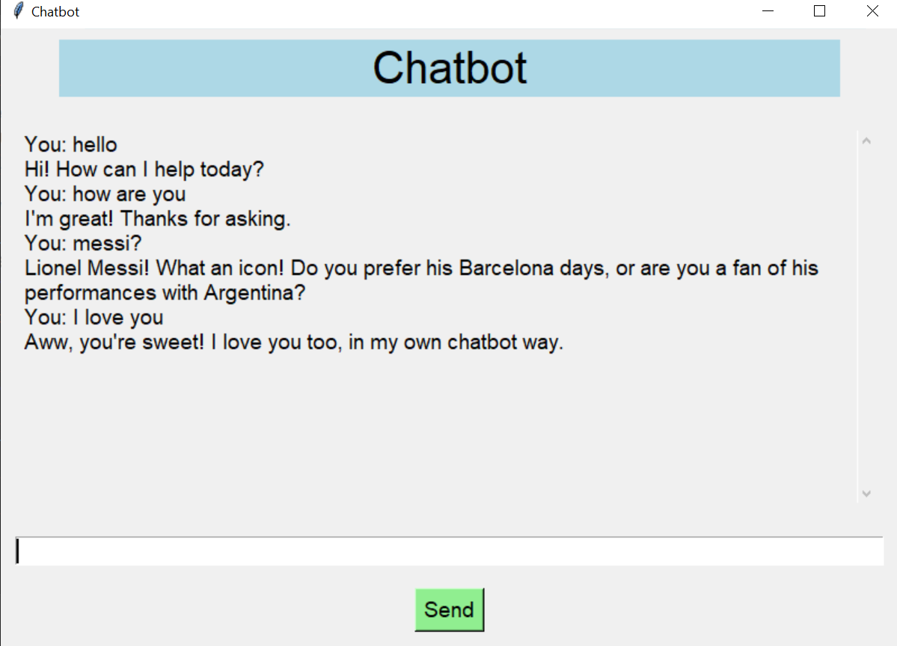

# Chatbot Model

This project is a conversational AI chatbot built using Natural Language Processing (NLP) techniques and machine learning. It provides automated responses based on user input, capable of learning new information and offering relevant answers.



## Versions

### 1. **Web-based App (Streamlit)**
- A web version of the chatbot will be available soon to interact with the chatbot in your browser.

### 2. **Local Desktop App (Tkinter)**
- This version allows users to run the chatbot locally with a GUI interface using Tkinter.
## **How to Run**
- Install the required libraries, you can run the following command:
```bash
   pip install scikit-learn nltk
```
- Clone the repository or download the source code.
- Navigate to the folder where the script is located.
- Run the Tkinter application by executing the script:
```bash
    python chatbot.py
```

## How It Works

The chatbot model uses the following techniques:

- **Text Preprocessing**: Expands contractions and removes punctuation from user input.
- **Cosine Similarity**: Matches user input with stored responses based on similarity using TF-IDF vectorization.
- **Synonym Expansion**: Expands queries with synonyms to improve matching accuracy.
- **Memory System**: Temporarily remembers new information during the session and uses it to improve responses.

### Libraries and Tools Used:
- **Python** for backend logic.
- **Tkinter** for the desktop app GUI.
- **Scikit-learn** for TF-IDF vectorization and cosine similarity.
- **NLTK** for natural language processing tasks (such as expanding contractions and finding synonyms).

## Code Explanation (Overview):
- The chatbot receives user input, processes it by expanding contractions and removing punctuation, and then searches for the best matching response from predefined data.
- If no match is found, it can "learn" new information by asking the user to provide an answer, storing it temporarily.

## Contributing

Anyone can collaborate to improve this project! Feel free to:
- Submit bug reports or feature requests.
- Fork the repository and submit pull requests to improve functionality, add new features, or enhance performance.

## License
This project is open source. See the LICENSE file for more details.
